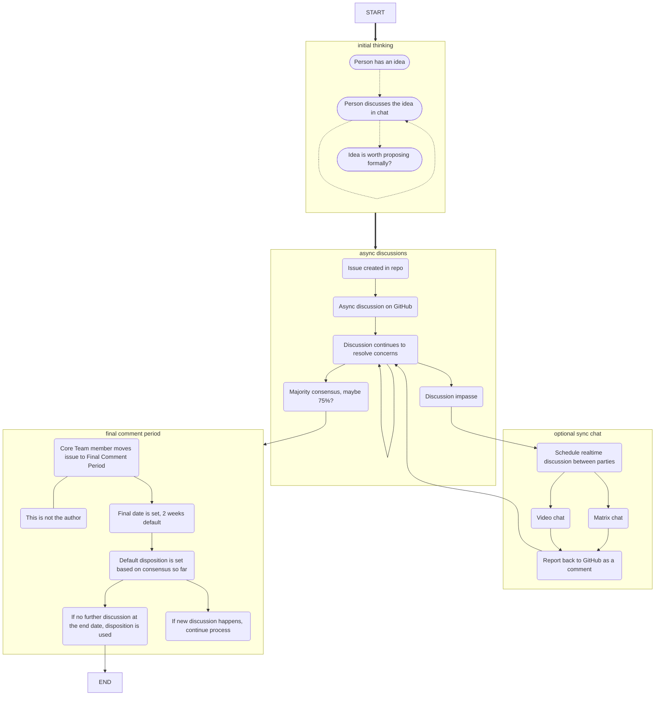

## Mermaid Chart for async workflow

This is a visual representation of the process:

```mermaid
flowchart TB;
  X[START] ==> thoughts;
  subgraph thoughts [initial thinking]
    direction TB
    A([Person has an idea]) .-> B
    B([Person discusses the idea in chat]) .->B .-> C
    C([Idea is worth proposing formally?])
  end
  thoughts ===> async
  subgraph async [async discussions]
    direction LR
    D(Issue created in repo) --> E(Async discussion on GitHub)
    E --> F(Discussion continues to resolve concerns) --> F --> G
    F --> J(Majority consensus, maybe 75%?)
  end  
    subgraph sync [optional sync chat]
      direction TB
      G(Discussion impasse) --> H
      H(Schedule realtime discussion between parties)
      H --> I1(Matrix chat) -->I
      H --> I2(Video chat) -->I
      I(Report back to GitHub as a comment) --> F
  end
  subgraph fcp [final comment period]
      direction TB
      K("Core" Team member moves issue to Final Comment Period)
      K --- K1(This is not the author)
      K --> L(Final date is set, 2 weeks default)
      L --> M(Default disposition is set based on consensus so far)
      M --> N(If no further discussion at the end date, disposition is used)
      M --> N1(If new discussion happens, continue process)
    end
    J --> fcp
    N --> Z[END]
```
